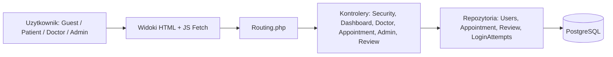
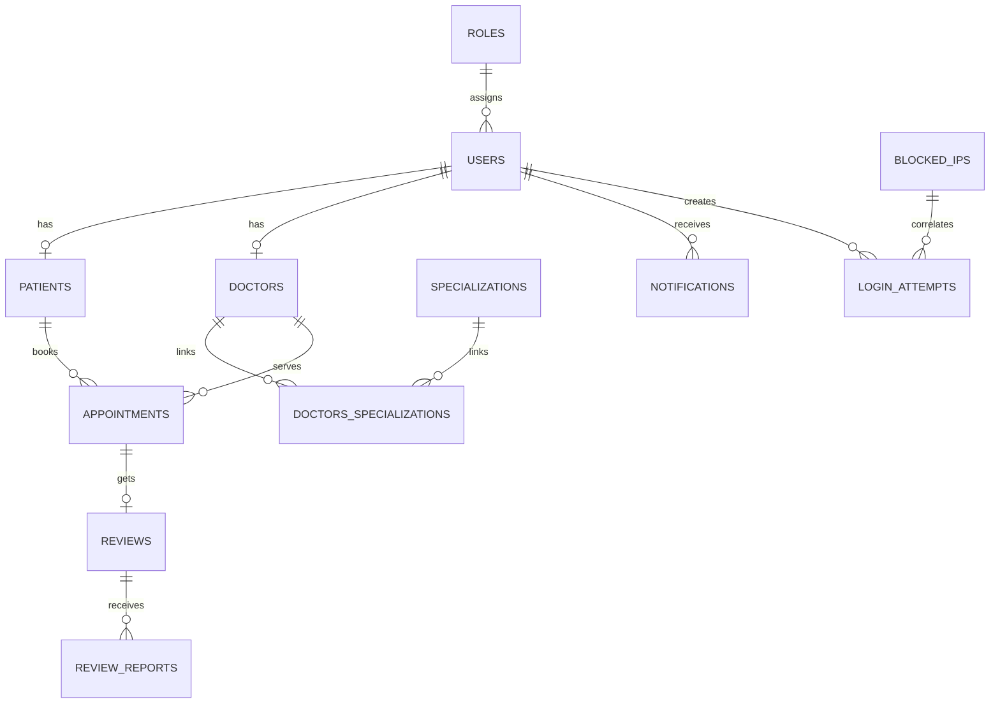
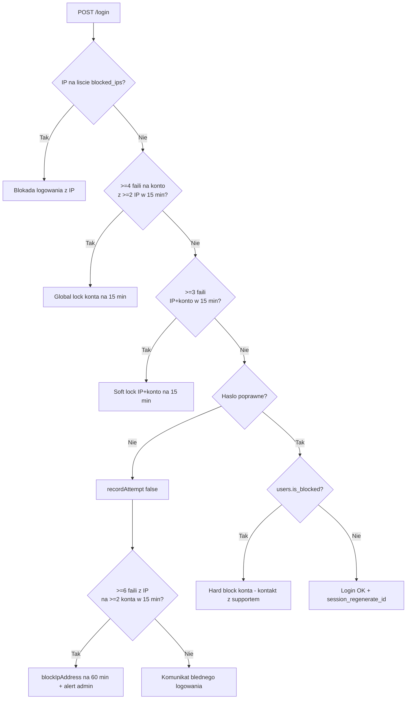
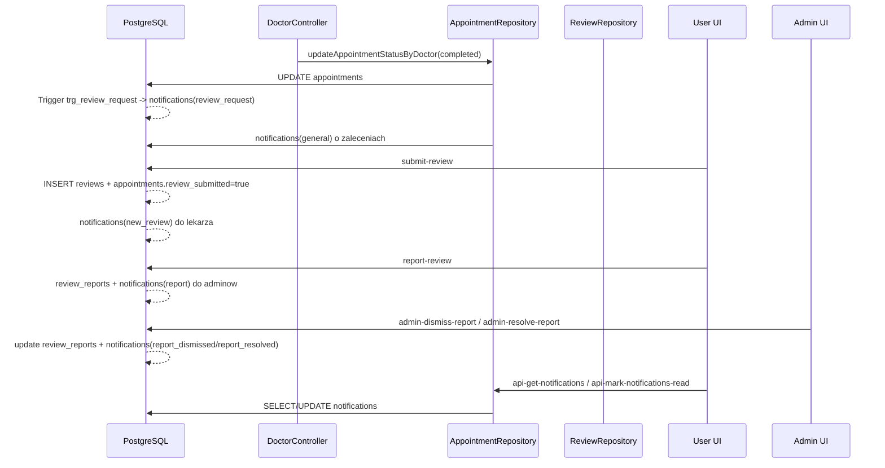
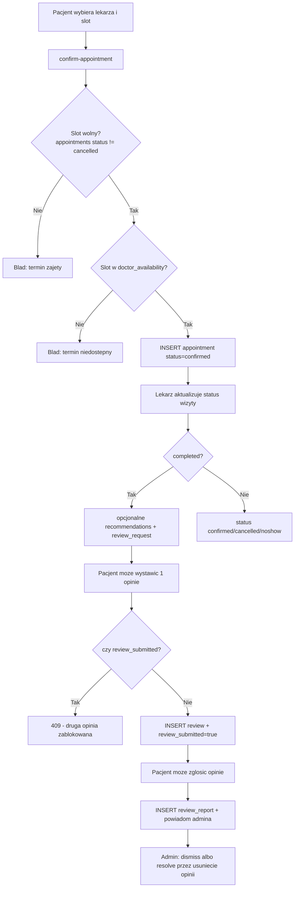
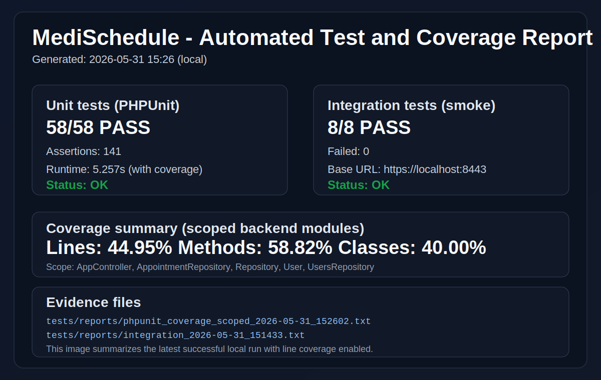

# MediSchedule - Projekt WDPAI

Aplikacja webowa do obslugi wizyt medycznych (pacjent, lekarz, admin) zbudowana bez frameworka, w architekturze MVC (PHP OOP + PostgreSQL + HTML/CSS/JS + Docker).

## 1. Najwazniejsze informacje

- **Technologie**: PHP 8.3, PostgreSQL, JavaScript (Fetch API), HTML5, CSS3, Docker Compose, Nginx.
- **Architektura**: custom MVC (kontrolery, repozytoria, widoki), bez frameworkow i bez gotowych szablonow UI.
- **Srodowisko uruchomieniowe**: kontenery `nginx`, `php`, `db`, `pgadmin`.
- **Adres aplikacji**: `https://localhost:8443`

## 2. Zakres funkcjonalny 

### 2.1 Pacjent
- Rejestracja, logowanie, wylogowanie, utrzymanie sesji.
- Dashboard pacjenta i lista wizyt.
- Wyszukiwanie lekarzy po nazwie/specjalizacji.
- Rezerwacja wizyty z walidacja terminu.
- Anulowanie wizyty.
- Zmiana danych profilu i hasla.
- Wystawianie opinii po zakonczonej wizycie (jedna opinia na wizyte).
- Zglaszanie opinii do moderacji.
- Obsluga powiadomien (odczyt, oznaczanie jako przeczytane, usuwanie, czyszczenie).

### 2.2 Lekarz
- Dashboard lekarza (statystyki + historia wizyt).
- Zarzadzanie statusem wizyt (`confirmed`, `completed`, `cancelled`, `noshow`).
- Dodawanie zalecen po wizycie.
- Edycja profilu lekarza (bio, cena, czas wizyty).
- Zarzadzanie dostepnoscia (tygodniowy grafik, daty dostepne, szablony).

### 2.3 Admin
- Dashboard administracyjny.
- Zarzadzanie uzytkownikami (dodawanie, edycja, usuwanie, blokada/odblokowanie).
- Ochrona przed usunieciem samego siebie i ostatniego admina.
- Moderacja opinii i zgloszen (usuwanie opinii, odrzucanie i rozwiazywanie reportow).
- Wglad w logi bezpieczenstwa i alerty.

## 3. Architektura i przeplyw

### 3.1 Diagram warstwowy



**Interpretacja**:
- `Routing.php` mapuje URL -> kontroler -> akcja.
- Kontrolery pilnuja autoryzacji, metod HTTP, walidacji i kodow odpowiedzi.
- Repozytoria realizuja operacje SQL (glownie prepared statements).

### 3.2 Model danych (ERD uproszczony)



**Interpretacja**:
- Relacje 1:1: `users -> patients`, `users -> doctors`.
- Relacja N:M: `doctors <-> specializations` przez `doctors_specializations`.
- Relacje 1:N: wizyty, powiadomienia, logi prob logowania.

## 4. Bezpieczenstwo

### 4.1 PHP SECURITY BINGO - wynik wdrozenia

**Wynik: 25/25 punktow zaimplementowanych (A1-E5).**


| Kod | Wymaganie | Status | Implementacja |
|---|---|---|---|
| A1 | SQL injection | OK | `src/repositories/*.php` (prepared statements) |
| B1 | Brak ujawniania istnienia emaila | OK | `src/controllers/SecurityController.php` |
| C1 | Walidacja formatu email po stronie serwera | OK | `SecurityController`, `DashboardController`, `AdminController` |
| D1 | Singleton/DI repozytorium usera | OK | `UsersRepository::getInstance`, konstruktory kontrolerow |
| E1 | HTTPS | OK | `docker/nginx/nginx.conf` + `AppController::requireHttps` |
| A2 | Login/register: zapis przez POST | OK | `SecurityController::login/register` |
| B2 | CSRF token login | OK | `SecurityController::login`, `AppController::verifyCsrf` |
| C2 | CSRF token register | OK | `SecurityController::register`, `AppController::verifyCsrf` |
| D2 | Limity dlugosci wejscia | OK | `SecurityController`, `DashboardController`, `AdminController` |
| E2 | Hashowanie hasel (bcrypt) | OK | `password_hash(..., PASSWORD_BCRYPT)` |
| A3 | Brak hasel w logach | OK | logowane sa email/IP/status, bez hasla |
| B3 | Regeneracja ID sesji po loginie | OK | `session_regenerate_id(true)` |
| C3 | Cookie HttpOnly | OK | konfiguracja sesji + remember cookie |
| D3 | Cookie Secure | OK | konfiguracja sesji + remember cookie |
| E3 | Cookie SameSite | OK | `Lax` dla session/remember |
| A4 | Limit prob logowania | OK | `LoginAttemptsRepository` |
| B4 | Zlozonosc hasla | OK | `AppController::validateStrongPassword` |
| C4 | Sprawdzenie emaila przy rejestracji | OK | `UsersRepository::emailExists` |
| D4 | Escaping/XSS | OK* | `htmlspecialchars` dla danych wyswietlanych od usera |
| E4 | Brak stack trace w produkcji | OK | Docker PHP config (`display_errors=Off`) + kontrolowane bledy |
| A5 | Poprawne kody HTTP | OK | 400/401/403/404/405/500 w kontrolerach |
| B5 | Haslo nie trafia do widokow | OK | brak przekazywania hasel do render() |
| C5 | Pobieranie potrzebnych danych | OK | selektywne `SELECT` w repozytoriach |
| D5 | Poprawny logout i niszczenie sesji | OK | `SecurityController::logout` |
| E5 | Logowanie nieudanych prob (bez hasel) | OK | `login_attempts` + `recordAttempt` |

\* Uwagi praktyczne: 

- Pola pochodzace bezposrednio od userow sa escapowane; czesc wartosci kontrolowanych systemowo (np. liczniki, statusy mapowane) renderowana jest bezposrednio.

- Hard block (`users.is_blocked`) to osobny mechanizm administracyjny (manualny, do odwolania).

- Ochrona CSRF obejmuje mutujace endpointy form i JSON przez token (`csrf_token` dla formularzy oraz `X-CSRF-Token` dla fetch), bez zmiany UX.

- Odczyt IP z `X-Forwarded-For` jest akceptowany tylko dla zaufanych proxy (sieci prywatne/loopback), co ogranicza spoofing naglowka.

## 5. Wymagane schematy

### 5.1 Mechanizm blokowania kont i IP (bledne logowanie)



**Interpretacja**:
- Progi: `3` (IP+konto), `4 / 2 IP` (global lock konta), `6 / 2 konta` (blokada IP).
- Blokada IP i lock konta sa automatycznie wykrywane z logow `login_attempts`.
- Hard block jest decyzja admina.

### 5.2 Mechanizm powiadomien



**Interpretacja**:
- Powiadomienia powstaja automatycznie w kilku miejscach: trigger DB, logika repozytoriow, moderacja admina.
- Odczyt i status `is_read` sa trzymane centralnie w tabeli `notifications`.

### 5.3 Logika biznesowa wizyt, walidacji, statusow i opinii



**Interpretacja**:
- Rezerwacja jest broniona warstwowo: konflikt slotu + zgodnosc z grafikiem lekarza.
- Jedna opinia na jedna wizyte jest egzekwowana biznesowo i technicznie.
- Moderacja reportow ma pelny obieg powiadomien.

## 6. Baza danych - zgodnosc z wymaganiami

- Relacje 1:1, 1:N i N:M sa obecne.
- Obiekty DB:
  - **Widoki**: `view_doctor_details`, `view_appointment_details`.
  - **Funkcje**: `notify_patient_review_request`, `check_doctor_availability_func`.
  - **Triggery**: `trg_review_request`, `check_doctor_availability_trigger`.
- Transakcje sa stosowane m.in. przy tworzeniu wizyty i operacjach administracyjnych.
- Dla integralnosci slotow wizyt zastosowano DB-level partial unique index: `uq_appointments_active_slot` (blokada podwojnej rezerwacji aktywnego terminu).

## 7. Testy automatyczne i pokrycie kodu

### 7.1 Testy jednostkowe (PHPUnit)

- Pliki:
  - `tests/AppControllerTest.php`
  - `tests/AppointmentRepositoryNotificationsTest.php`
  - `tests/UsersRepositoryTest.php`
  - `tests/AppointmentControllerSanitizeReturnToTest.php`
  - `tests/SecurityControllerHelpersTest.php`
  - `tests/UserModelTest.php`
  - `tests/RepositoryTest.php`
- Ostatni wynik: **58 testow, 141 asercji, OK**.
- Ostatni wynik: **61 testow, 145 asercji, OK**.
- Zakres:
  - polityka hasla i detekcja JSON/request context,
- logika notyfikacji i operacje na wizytach w `AppointmentRepository`,
- operacje admin/profile w `UsersRepository`,
- sanitizacja redirectow (`return_to`) i helpery security,
- podstawowa instancjacja warstwy repo + model `User`.

### 7.2 Testy integracyjne (smoke)

- Skrypty:
  - `tests/integration_test.ps1`
  - `tests/integration_test.sh`
- Ostatni wynik: **13/13 PASS**.
- Pokryte scenariusze:
  - publiczne trasy (`/login`, 404),
  - ochrona endpointow API bez sesji (401),
  - zgodnosc odpowiedzi JSON dla API.

### 7.2.1 Raport automatyczny (material do screena)



- Szczegolowy raport: [docs/reports/test-report-2026-05-31.md](docs/reports/test-report-2026-05-31.md)
- Log PHPUnit + coverage: [tests/reports/phpunit_coverage_scoped_2026-05-31_152602.txt](tests/reports/phpunit_coverage_scoped_2026-05-31_152602.txt)
- Clover XML coverage: [tests/reports/coverage_scoped_2026-05-31_152602.xml](tests/reports/coverage_scoped_2026-05-31_152602.xml)
- HTML coverage: [tests/reports/coverage_scoped_html_2026-05-31_152602/index.html](tests/reports/coverage_scoped_html_2026-05-31_152602/index.html)
- Log integracji: [tests/reports/integration_2026-05-31_151433.txt](tests/reports/integration_2026-05-31_151433.txt)

### 7.3 Pokrycie kodu (Xdebug)

- **Coverage scope (moduly backend objete unit testami):**
  - `AppController`
  - `AppointmentRepository`
  - `Repository`
  - `User`
  - `UsersRepository`
- **Wynik coverage:**
  - Classes: **40.00%** (2/5)
  - Methods: **58.82%** (40/68)
  - Lines: **44.95%** (218/485)

Wniosek praktyczny:
- Wzrost testow automatycznych i metryk coverage jest znaczacy wzgledem poprzedniego stanu.
- Dalszy wzrost wymaga dopisania testow dla pozostalych kontrolerow i scenariuszy end-to-end.

## 8. Instrukcja uruchomienia

### 8.1 Wymagania
- Docker + Docker Compose.
- Porty wolne: `8080`, `8443`, `5433`, `5050`.

### 8.2 Start aplikacji

1. Sklonuj repozytorium.
2. Ustaw zmienne (opcjonalnie przez `.env`):
   - wzorzec jest w `.env.example`.
3. Uruchom:

```bash
docker-compose up -d --build
```

4. Otworz:
- aplikacja: `https://localhost:8443`
- pgAdmin: `http://localhost:5050`

### 8.3 Testy

### PHPUnit

```bash
docker-compose exec php sh -lc "wget -q -O /tmp/phpunit.phar https://phar.phpunit.de/phpunit-11.phar; php /tmp/phpunit.phar --configuration /app/phpunit.xml"
```

### Integracja (Windows PowerShell)

```powershell
./tests/integration_test.ps1
```

### Integracja (Linux/macOS)

```bash
bash ./tests/integration_test.sh
```

## 9. Scenariusz Testowy (krok po kroku)

1. Uruchom aplikacje i otworz `https://localhost:8443`.
2. Zaloguj sie kolejno jako patient, doctor, admin i potwierdz przekierowania do odpowiednich dashboardow.
3. Patient: wyszukaj lekarza, zarezerwuj slot, anuluj wizyte, zaktualizuj profil i haslo.
4. Doctor: ustaw dostepnosc tygodniowa, zmien status wizyty na `completed`, dodaj zalecenia.
5. Patient: wystaw opinie do zakonczonej wizyty i zglos opinie (report).
6. Admin: obsluz report (`dismiss` / `resolve`), wykonaj CRUD usera i test blokady/odblokowania konta.
7. Weryfikuj statusy 401/403/404 na trasach nieautoryzowanych i nieistniejacych.
8. Potwierdz dzialanie obiektow DB: trigger `trg_review_request`, widoki i funkcje.

## 10. Checklista wdrozenia

- [x] MVC OOP bez frameworka
- [x] Docker + PostgreSQL + HTTPS
- [x] Role i autoryzacja (patient/doctor/admin)
- [x] CRUD i logika biznesowa wizyt
- [x] Powiadomienia + moderacja opinii
- [x] Ochrona SQLi/XSS/CSRF/Sesji
- [x] Logowanie prob logowania i lockout
- [x] Testy jednostkowe + integracyjne
- [x] Strony bledow 400/401/403/404/500

## 11. Materialy Do Uzupelnienia Przed Oddaniem

- Dodaj screeny aplikacji web i mobile do `docs/assets/` oraz podlinkuj je w README.
- Dodaj diagram ERD w formacie PNG/SVG do `docs/assets/` oraz link do pliku zrodlowego (np. draw.io).
- Zweryfikuj, ze finalny commit zawiera aktualne artefakty raportowe (test report + screenshoty).